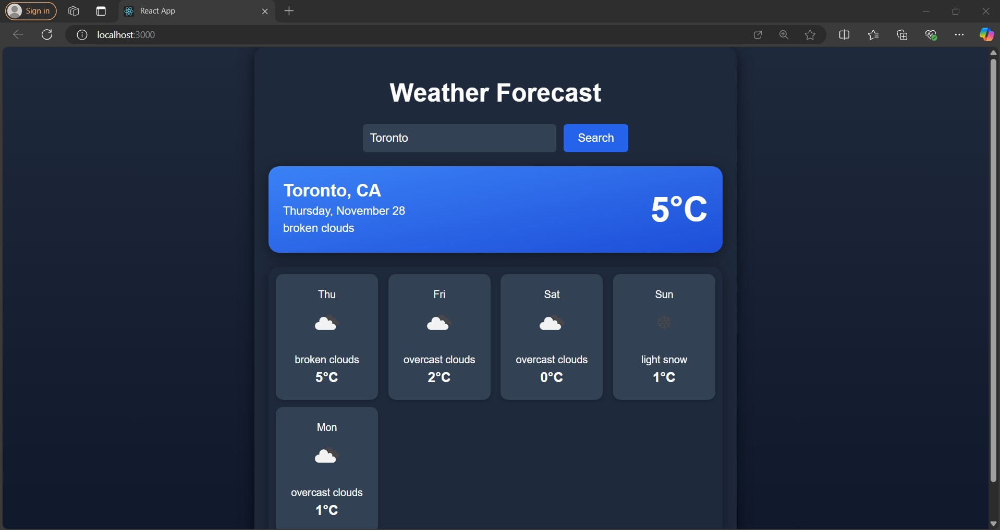

# Weather Forecast App 🌦️

This Weather Forecast App allows users to check the 5-day weather forecast for any city, with a beautifully designed interface that displays temperature, humidity, and other details for the selected city. The default city is set to Toronto.

## Features ✨

* Search City Weather: Enter the name of a city to get its 5-day weather forecast.
* Current Weather: Displays the current temperature and weather conditions.
* Daily Forecast: Shows daily temperatures, weather conditions eg-sunny, cloudy, etc.., and weather icons for the next 5 days.
* Responsive Design: Optimized for various screen sizes and devices.
* Default City: Starts with weather data for Toronto.

## Screenshots 📸
1. Home Screen (Default City: Toronto)


## Installation & Setup Instructions 🛠️
Follow the steps below to set up and run the app locally:

## Prerequisities
Node.js: Ensure Node.js is installed. Download [Node.js](https://nodejs.org/)


## Steps
1. Clone the repository:
```git clone https://github.com/karmpatels/101410114_comp3123_labtest2.git```

2. Install dependencies
```npm install```

3. Start the app
```npm start```

## API Usage 🌐
This application uses the [OpenWeatherMap](https://home.openweathermap.org/api_keys) API to fetch weather data.

### API Features:
* City Weather: Retrieves weather data based on the user's city search.
* 5-Day Weather: Provides the weather data for the 5 days.

## Project Structure 📁

public/ ├── favicon.ico ├── index.html ├── logo192.png ├── logo512.png ├── manifest.json └── robots.txt

src/ ├── App.css ├── App.js ├── App.test.js ├── index.css ├── index.js ├── logo.svg ├── reportWebVitals.js └── setupTests.js

.gitignore README.md package-lock.json package.json

## Technologies Used 🛠️
1. React.js: Frontend framework
2. Axios and Fetch: HTTP client for API requests
3. CSS: Styling for the App
4. OpenWeatherMap API: Weather data provider

## Author 🙋‍♂️
1. Karm Patel
2. Github: [karmpatels](https://github.com/karmpatels)